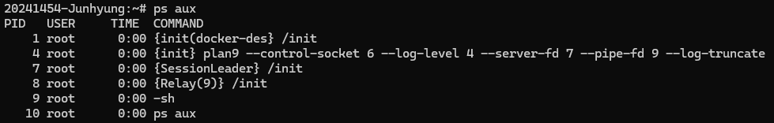
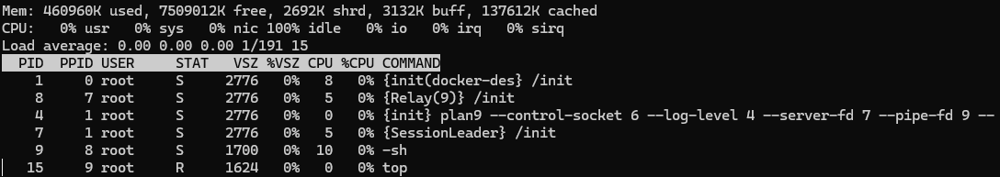
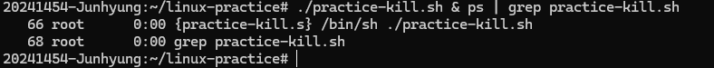

# Day 3
## 1. Check Running Process
```bash
# Show process for current user
ps
# Show full details of all running process
ps aux
```


### ps
ps means 'Process Status'. And the option aux are :
- a : show processes from all users
- u : show the user of each process with detailed info
- x : show processes not attached to a terminal (e.g. background jobs)

So that means `Show me all running process from all Users, with detailed info, and those running in the background`.

## 2. Live Monitoring
```bash
top
```
It shows live list of running process and memory usage. It is such as Windows monitoring tool (Ctrl+Alt+Del).

You can quit this pressing `Q`.

## 3. Kill a Process
```bash
# Find specific running script_name
ps aux | grep script_name
# Kill the process by pid (process ID)
kill 12345
```
When you type `ps aux`, You can see all of running process.
I wrote a code to practice this `kill` command safely without installing application in WSL.

### 3-1. Create script file (Optional)
#### 1. Check sh or bash
```bash
echo 0$
```
when you type this on your wsl command, it shows one of bash or sh.
#### 2. Create file
```bash
# This is what i like to code

#!/bin/sh
echo "echo hell from sh"
sleep 500
while true; do
  echo "still running ... PID:9"
  sleep 5
done
```
#!/bin/bash is called a shebang, 
it tells Linux to run this file using the bash interpreter.

So depends on the result of previous step, you can change it `#!/bin/sh`. 

```bash
# I cannot say it is the best way to code but i did in this way
20241454-Junhyung:~/linux-practice# echo "#!/bin/sh" > practice-kill.sh
20241454-Junhyung:~/linux-practice# echo "echo hell from sh" >> practice-kill.sh
20241454-Junhyung:~/linux-practice# echo "while true; do" >> practice-kill.sh
20241454-Junhyung:~/linux-practice# echo -e "  echo \"still running ... PID:$$\"" >> practice-kill.sh
20241454-Junhyung:~/linux-practice# echo "  sleep 5" >> practice-kill.sh
20241454-Junhyung:~/linux-practice# echo "done" >> practice-kill.sh
```
Firstly, I create a file named `practice-kill.sh` with the first line `#!/bin/sh`. After that, I appended each line to the file.

#### 3. Run in the background
```bash
20241454-Junhyung:~/linux-practice# ./practice-kill.sh & ps | grep practice-kill.sh
```
`&` means run it in the background.
`ps | grep practice-kill.sh` means that show the lines which contains practice-kill.sh from a running process list



#### 4. Kill the process
```bash
20241454-Junhyung:~/linux-practice# kill 66
```
The pid is depends on ps list.
*You cannot kill grep | practice-kill.sh. So don't mixed up with 68 and 66.*
